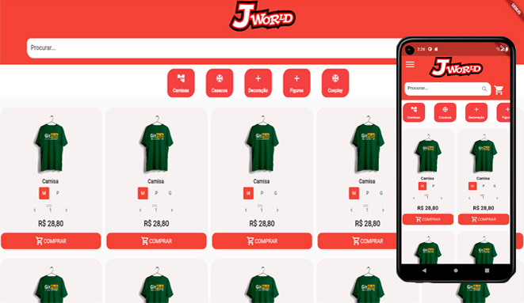

<h1>J-World</h1>

Mini Project, in flutter Multi-Screen

## Getting Started

Trying to improve my skills in pure flutter.

I'm not using any library like Get X or Mob x and others, I want to see how far I can go using just Bus event and Singletoon

47.8% completed

  

